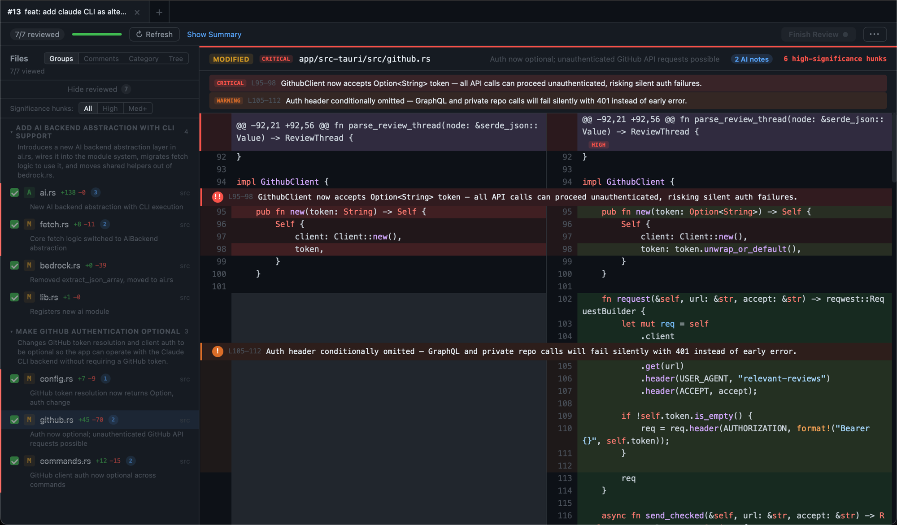

# Marrow

[](https://github.com/Besendorfer/marrow/releases/latest)
[](https://github.com/Besendorfer/marrow/releases)
[](LICENSE)
[-lightgrey)](https://github.com/Besendorfer/marrow/releases/latest)

A desktop app that uses AI to surface only the parts of a GitHub pull request that matter -- business logic, infrastructure, API changes -- so you can focus your review where it counts.

<p align="center">
  
</p>

## Why?

A typical pull request touches 30-50 files. Most of them are UI components, tests, lock files, and config -- noise that buries the changes that actually matter. Reviewers either spend time scrolling past irrelevant diffs or start skimming and miss critical logic changes.

Marrow loads a PR, uses AI to classify every file by what it contains, and surfaces only the business logic, infrastructure, and API changes. A second AI pass highlights the specific lines that deserve attention -- auth changes, removed safety checks, breaking API contracts -- so you know exactly where to focus.

**In a typical 40-file PR, only 8-12 files contain reviewable business logic. Marrow finds them in seconds.**

## Download

**[Download for macOS (Apple Silicon)](https://github.com/Besendorfer/marrow/releases/latest/download/Marrow_aarch64.dmg)**

Or browse [all releases](https://github.com/Besendorfer/marrow/releases).

> The app is signed and notarized by Apple. After downloading the `.dmg`, open it and drag "Marrow" to your Applications folder. Auto-updates are built in -- you'll be notified when new versions are available.

## Terminal (CLI/TUI)

Marrow also ships as a terminal app -- the same fetch/classify/review workflow in an interactive TUI, built on the same core (no webview).

```bash
# From a clone (works today):
cargo install --path app/src-tauri/crates/cli

# From crates.io (once published — the crate is `marrow-cli`, the command is `marrow`):
cargo install marrow-cli

marrow init        # scaffold ~/.config/marrow/config
marrow review <pr> # fetch + classify, then open the TUI
```

`<pr>` is a URL, `owner/repo/pull/N`, or `owner/repo#N`. See [the CLI readme](app/src-tauri/crates/cli/README.md) for the full command list.

## How it works

1. **Fetch** -- pulls PR metadata, file list, and diff via the GitHub REST API
2. **Classify** -- sends the file list and diff to Claude, which labels each file as RELEVANT or NOT_RELEVANT based on what it contains
3. **Highlight** -- a second AI pass identifies specific lines in relevant files that deserve human attention (security changes, behavior changes, removed safety checks, etc.)
4. **Summarize** -- generates a high-level summary of the PR's changes
5. **Review** -- displays the relevant diffs in a split or unified viewer with syntax highlighting, AI-annotated risk indicators, and inline comments

## Features

- **PR opener** -- paste a PR URL or short ref (`owner/repo#123`) directly in the app
- **AI classification** -- files automatically categorized and scored by risk level (critical / high / medium / low)
- **AI highlights** -- specific lines annotated with severity (critical / warning / info) and explanatory comments
- **AI summaries** -- high-level overview of what the PR changes and why it matters
- **Change groups** -- AI-generated logical grouping of related file changes
- **Split and unified diff views** -- toggle between side-by-side and unified diff display
- **File sidebar** -- files grouped by category with risk indicators; track which files you've reviewed
- **Review request list** -- see incoming review requests from GitHub
- **PR comments and threads** -- read, reply to, and resolve review threads; react with emoji
- **PR checks** -- monitor CI/CD check status with blocking-check alerts
- **Search** -- full-text search across all diffs with result navigation
- **Viewed file tracking** -- persistent progress tracking across sessions with stale-file detection
- **PR update detection** -- detects new commits and highlights files changed since your last review
- **Multi-tab** -- open multiple PRs simultaneously in separate tabs
- **Auto-update** -- background update checks with one-click download and relaunch
- **Drag-and-drop** -- drop a manifest JSON file onto the app to load a review
- **Settings** -- configure model ARN, GitHub token, and AWS profile from within the app

## Prerequisites

You'll need:

- An **AI model + key**. The provider is auto-detected from the model name; set the matching API key (config setting or env var):
  - `claude*` -> **Anthropic** (`anthropic_api_key` / `ANTHROPIC_API_KEY`), or just a model name with the [Claude CLI](https://docs.anthropic.com/en/docs/claude-cli) installed
  - `gpt*` / `o3*` -> **OpenAI** (`openai_api_key` / `OPENAI_API_KEY`)
  - `gemini*` -> **Gemini** (`gemini_api_key` / `GEMINI_API_KEY`)
  - an AWS **Bedrock** model ARN with AWS credentials configured (env vars, `~/.aws/credentials`, or SSO)
  - **OpenRouter / a local server / any OpenAI-compatible endpoint** -- set `provider=openai-compatible` + `openai_base_url` + `openai_api_key`
- A **GitHub personal access token** (or `GH_TOKEN` / `GITHUB_TOKEN` environment variable)

## Configuration

Settings are stored in `~/.config/marrow/config` (run `marrow init` to scaffold it) and can be edited from the app's Settings modal.

| Setting | Description |
|---|---|
| `model` | Model name (`claude*` / `gpt*` / `gemini*`) or AWS Bedrock ARN |
| `github_token` | GitHub personal access token (optional if `GH_TOKEN` / `GITHUB_TOKEN` env var is set) |
| `anthropic_api_key` | Anthropic API key for `claude*` models (or `ANTHROPIC_API_KEY`) |
| `openai_api_key` | OpenAI / OpenAI-compatible key for `gpt*`/`o3*` (or `OPENAI_API_KEY`) |
| `gemini_api_key` | Gemini key for `gemini*` models (or `GEMINI_API_KEY`) |
| `provider` | Optional override (`openai` / `gemini` / `openai-compatible` / …); blank = auto-detect |
| `openai_base_url` | OpenAI-compatible base URL for OpenRouter / a local server (or `OPENAI_BASE_URL`) |
| `aws_profile` | AWS profile name (only used with Bedrock ARNs; uses default credential chain if empty) |

GitHub token resolution order: config file > `GH_TOKEN` env > `GITHUB_TOKEN` env.

> **Secret storage.** The token and API keys are written to this config file in
> **plaintext** (`0600` / owner-only on macOS & Linux; user-profile ACLs on
> Windows). Keys are never logged or printed (`marrow settings` shows only
> `set` / `not set`). To keep secrets off disk, leave the fields blank and use
> the environment variables instead. Note that `~/.config` can be picked up by
> backups / dotfile sync. See [SECURITY.md](SECURITY.md); OS-keychain storage
> is a tracked future enhancement.

When using a Bedrock ARN, the AWS region is extracted automatically from the ARN. When using a model name, the app invokes the `claude` CLI.

## Building from source

### Prerequisites

- [Rust](https://rustup.rs/)
- [Bun](https://bun.sh/)
- Tauri v2 prerequisites: see [Tauri Getting Started](https://v2.tauri.app/start/prerequisites/)

### Setup and build

```bash
cd app
bun install
bun run tauri build
```

The built app will be at `app/src-tauri/target/release/bundle/macos/Marrow.app`.

### Development

```bash
cd app
bun install
bun run tauri dev
```

## How files are classified

**RELEVANT** (shown for review):
- Backend business logic (services, handlers, controllers, routers, middleware)
- Infrastructure-as-code (CDK, SST, Terraform, CI/CD workflows)
- API routes, tRPC routers, REST endpoints
- Database schemas, migrations, seeds
- Auth/authz logic
- Domain types (DTOs, entities, models)
- Configuration that affects runtime behavior (feature flags, environment configs)
- Shared libraries and utilities used by business logic

**NOT RELEVANT** (skipped):
- UI components (React JSX, CSS, layouts)
- Tests (any file matching `*.test.*`, `*.spec.*`, `__tests__/`, etc.)
- Documentation
- IDE/editor config
- Package manager lock files
- Build/tooling config
- Type declaration files that only re-export or define UI prop types
- Static assets and auto-generated files

## CLI (`rr`)

A standalone Bash script that performs the same fetch/classify/highlight workflow using the `gh` CLI and `claude` CLI. It can output results as a manifest JSON, print classification summaries, or open diffs in VSCode.

### Prerequisites

- [GitHub CLI (`gh`)](https://cli.github.com/) -- authenticated with access to your repos
- [Claude CLI (`claude`)](https://docs.anthropic.com/en/docs/claude-cli) -- for AI classification
- `jq`, `python3`

### Setup

```bash
chmod +x rr

# (Optional) Symlink into a directory on your PATH
ln -s "$(pwd)/rr" /usr/local/bin/rr

# Set the model (env var or config file)
export RR_MODEL="claude-sonnet-4-6"
```

### Usage

```
rr <pr-url-or-ref> [options]
```

| Option | Description |
|---|---|
| `<pr-url-or-ref>` | GitHub PR URL, `owner/repo#number`, or just a number (if inside a repo) |
| `--list-only` | Only print the classification results, don't open any viewer |
| `--manifest-only` | Build the manifest JSON and print its path |
| `--vscode` | Open diffs in VSCode instead of the desktop app |
| `--help` | Show help |

### Examples

```bash
# Full PR URL
rr https://github.com/myorg/myrepo/pull/123

# Short form
rr myorg/myrepo#123

# Just a number (when inside a git repo with a GitHub remote)
rr 123

# List classification only
rr 123 --list-only

# Open in VSCode
rr 123 --vscode
```

## License

MIT
